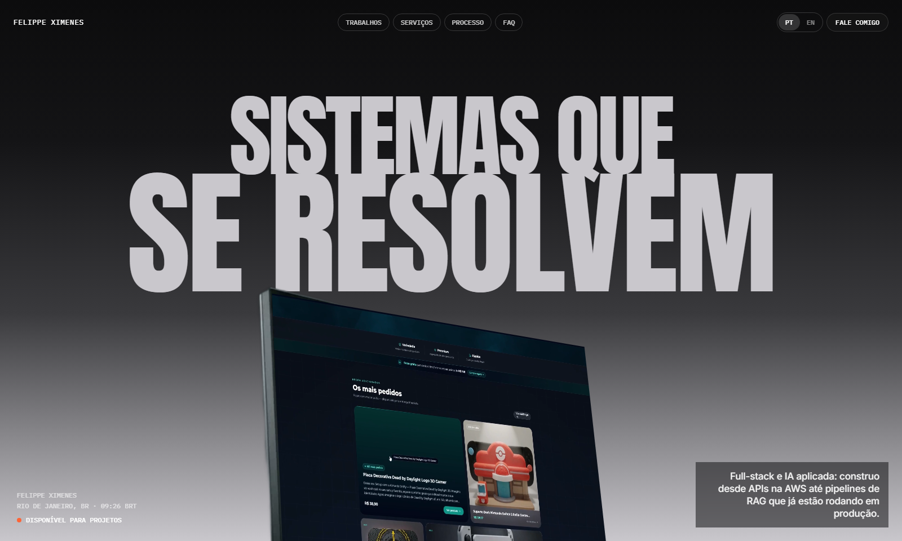
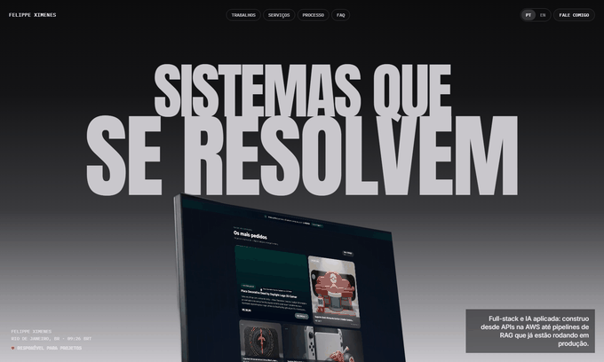
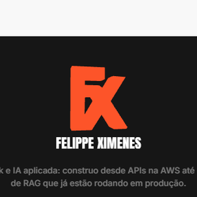
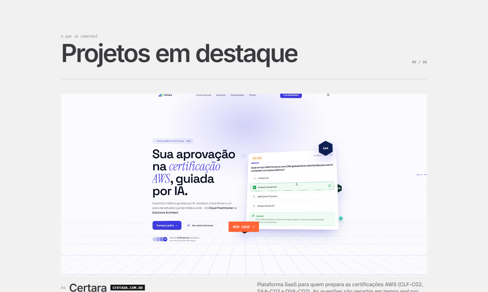
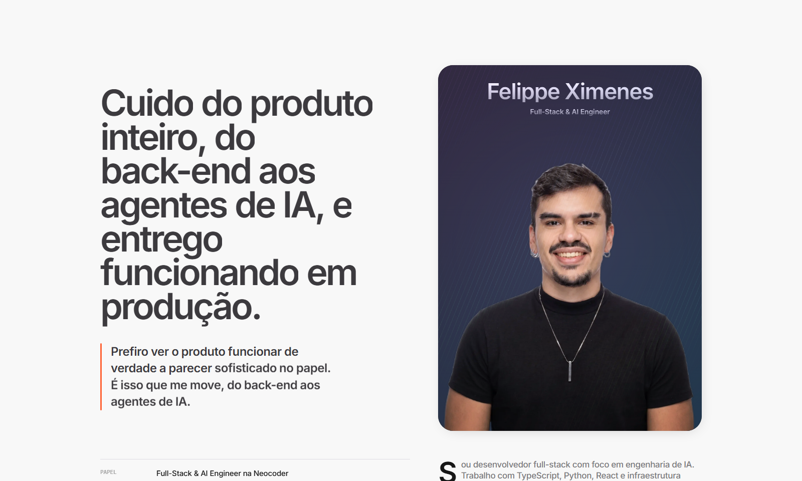
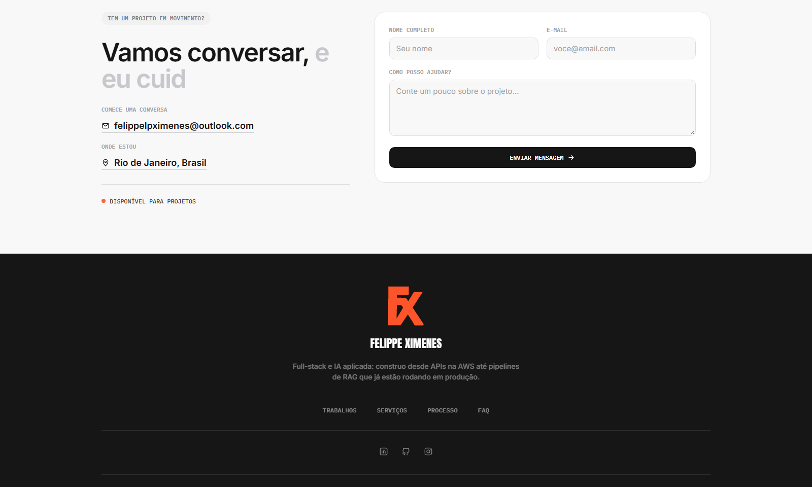
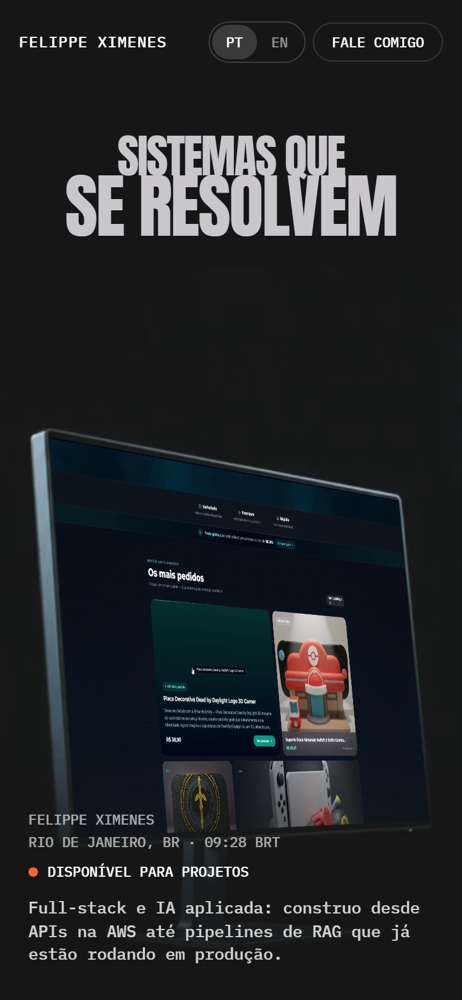

<div align="center">

# Felippe Ximenes · Portfolio

Portfolio pessoal de desenvolvedor full-stack focado em engenharia de IA. Construído do zero em React + TypeScript, sem nenhum template ou UI kit: cada seção, animação e interação foi feita à mão, incluindo um efeito de scroll no Hero com compositing de vídeo em tempo real e um logo 3D reativo ao mouse no rodapé.

**[▸ ver o site no ar](https://meu-port-sooty.vercel.app/)**

</div>



## Sobre o projeto

Esse é o meu portfolio pessoal. Além de mostrar os projetos, ele também é uma vitrine de front-end na prática: scroll storytelling, compositing de vídeo via CSS, um modelo 3D construído a partir de um logo 2D, tudo em cima de React puro, sem framework de animação genérico segurando a mão.

O site é bilíngue (PT/EN), 100% responsivo, e roda em produção na Vercel.

## O efeito principal: o Hero



A primeira coisa que aparece no site é esse efeito: conforme o usuário rola a página, a câmera "entra" na cena de um monitor em cima de uma mesa, e a tela do monitor acende com uma prévia real de um dos projetos, como se fosse um vídeo tocando dentro da foto.

Isso **não é um vídeo de fundo comum**. É um compositing feito em três camadas, sincronizadas quadro a quadro com o scroll:

1. Uma sequência de 145 fotos (não um `.mp4`) do monitor sendo filmado com um zoom-in gradual, desenhadas quadro a quadro num `<canvas>` conforme o usuário rola. Isso permite "scrubar" a cena junto com o scroll sem depender de `video.currentTime`, que é lento e impreciso para esse tipo de sincronização.
2. Um segundo vídeo real (a demo do projeto) é recortado e distorcido via CSS `matrix3d`, para se encaixar exatamente dentro da tela do monitor em cada quadro, mesmo com o monitor girando e mudando de tamanho por causa do zoom da câmera.
3. Os dados de encaixe (os 4 cantos da tela, em cada um dos 145 quadros) vieram de uma gravação em fundo verde: eu trackeei manualmente o quadrilátero da tela quadro a quadro e uso essas coordenadas para calcular, em tempo real, a transformação `matrix3d` que projeta o vídeo dentro desse quadrilátero.

Essa foi, de longe, a parte que mais deu trabalho do projeto inteiro. Ver a seção [Maiores desafios](#maiores-desafios) para os detalhes.

## Destaques

### Logo 3D interativa no rodapé



O "FX" do rodapé não é uma imagem estática: é um modelo 3D de verdade, renderizado com Three.js, que reage à posição do cursor com um leve giro e um aumento de escala. Para isso, tracei o contorno (silhueta) do logo original a partir do canal alfa do PNG, gerei um path vetorial offline (Python + scikit-image) e extrudei esse path em uma geometria 3D real (`ExtrudeGeometry`), nada de sprite giratório ou distorção 2D fingindo profundidade. O material é propositalmente "sem luz" (`MeshBasicMaterial`), então a cor da marca nunca muda de tom conforme o ângulo, só o volume.

### Projetos com preview em vídeo



O grid de projetos tem uma legenda "Ver case" que segue o cursor com um efeito magnético, um wipe direcional (a imagem "abre" a partir do lado por onde o mouse entrou) e troca a capa estática por um preview em vídeo do projeto ao passar o mouse. Tudo isso só em telas com mouse de verdade (`pointer: fine`); no touch, cai graciosamente para o comportamento padrão de link.

### Seção Sobre



### Rodapé e formulário de contato



Formulário de contato funcional (sem backend próprio, envia direto por um serviço de e-mail), com estado de sucesso/erro tratado.

### Responsivo de verdade



O Hero mobile não é o mesmo efeito "encolhido": é uma segunda gravação, feita em retrato, com seu próprio tracking e sua própria curva de câmera, porque o efeito desktop simplesmente não se sustenta reduzido para uma tela vertical.

## Stack

| Categoria | Tecnologias |
|---|---|
| Core | React 18, TypeScript, Vite |
| 3D | Three.js (`ExtrudeGeometry`, `WebGLRenderer`) |
| Animação de scroll | GSAP + ScrollTrigger (timeline da seção Experience) |
| Efeito do Hero | Canvas 2D + CSS `matrix3d` (homografia calculada à mão, sem lib) |
| i18n | Context de React feito na mão (PT/EN), sem biblioteca de i18n |
| Observability | Vercel Analytics + Speed Insights |
| Deploy | Vercel |

Sem Tailwind, sem styled-components, sem UI kit: os estilos são feitos com objetos de estilo inline, mais algumas classes utilitárias pontuais em `index.css` para o que precisa de media query, hover ou `@keyframes`.

## Estrutura

```
src/
├── components/
│   ├── Hero.tsx           # efeito de scroll com corner-pin de vídeo (o mais complexo)
│   ├── LogoGL.tsx          # logo 3D interativa do rodapé (Three.js)
│   ├── Nav.tsx, Footer.tsx, Preloader.tsx
│   ├── SobreSection.tsx, Projects.tsx, Services.tsx
│   ├── Process.tsx, Experience.tsx, FaqSection.tsx
│   └── SplitHeading.tsx, TextType.tsx   # utilitários de tipografia animada
├── hooks/
│   ├── useReveal.ts        # reveal por IntersectionObserver com stagger
│   ├── useMagnetic.ts      # atração de botões em direção ao cursor
│   └── useGhostParallax.ts # parallax horizontal ligado ao scroll
├── contexts/LanguageContext.tsx  # PT/EN
├── data/logoPath.json      # contorno vetorial do logo, gerado offline
├── data.ts                 # projetos, skills, FAQs, links
└── i18n.ts                 # todas as strings PT/EN do site

public/
├── hero-frames/             # 145 quadros do Hero desktop
├── hero-frames-mobile/      # quadros do Hero mobile (gravação separada)
├── quad_tracking.json       # cantos da tela trackeados, por quadro (desktop)
├── quad_tracking_mobile.json
└── video-case.mp4           # vídeo corner-pinado dentro da tela do monitor

source-footage/              # (git-ignored) gravações originais em fundo verde,
                              # usadas offline para gerar os quadros e o tracking
```

## Maiores desafios

**O encaixe do vídeo dentro da tela do monitor.** O quadrilátero da tela muda de posição, tamanho e ângulo em cada um dos 145 quadros, já que a câmera se move e dá zoom durante o scroll. Não dava pra usar uma margem de segurança fixa em porcentagem para esconder a borda do fundo verde: como o quadrilátero rastreado praticamente dobra de tamanho do início ao fim do scroll, uma margem percentual fica pequena demais no começo (deixa uma fresta verde visível) e grande demais no final (passa por cima da moldura física do monitor, escondendo-a). A solução foi converter a margem para um valor fixo em pixels *na escala de cada quadro*, recalculado a cada frame a partir da distância real entre os cantos rastreados e o centro, o que manteve a cobertura visualmente constante do primeiro ao último quadro. Cada ajuste nessa margem foi validado escrevendo scripts que abrem a página, calculam a posição exata do quadrilátero renderizado e verificam pixel a pixel se ainda existe algum resíduo de verde: a olho nu essa diferença de poucos pixels é praticamente impossível de flagrar de forma confiável.

**Duas versões completamente separadas para desktop e mobile.** Tentar espremer a gravação widescreen do desktop numa tela vertical simplesmente não funcionava, o enquadramento ficava errado e a "atuação" da câmera parecia forçada. A solução foi gravar uma segunda cena em retrato, com sua própria curva de câmera e seu próprio arquivo de tracking, em vez de tentar recortar ou adaptar a mesma fonte para os dois formatos.

**Fazer o logo 3D parecer de marca, não um efeito genérico.** O requisito era: cor nunca pode mudar de tom (então nada de luz/sombra no material) e tem que ser volume real, não um truque 2D. Isso significou extrair a silhueta exata da logo (via canal alfa), transformar esse contorno num path vetorial fiel, inclusive o buraco interno do "F", e só então extrudar. No caminho, o primeiro ajuste de rotação era exagerado demais: em ângulos extremos do cursor a logo virava de perfil e ficava irreconhecível, foi preciso reduzir e testar especificamente os cantos mais extremos do hover antes de considerar pronto.

**Testar um site sem test runner tradicional.** Boa parte da validação de UI aqui não é do tipo que um teste de unidade pega, é "esse pixel específico está da cor certa depois de rolar até 63% da seção?". Isso empurrou o fluxo de trabalho pra automação de navegador sob demanda (Playwright): abrir a página, simular o scroll ou o hover exato, e inspecionar tanto o DOM/CSS computado quanto os pixels renderizados, em vez de confiar só na inspeção visual.

## Rodando localmente

```bash
npm install
npm run dev
```

Build de produção:

```bash
npm run build
npm run preview
```

> Os vídeos-fonte usados para gerar `public/hero-frames*` e os arquivos de tracking não fazem parte do repositório (ficam em `source-footage/`, fora do controle de versão). O site funciona normalmente com os quadros já extraídos que estão versionados em `public/`.

## Contato

- [LinkedIn](https://www.linkedin.com/in/felippeximenes/)
- [GitHub](https://github.com/felippeximenes)
- [Instagram](https://www.instagram.com/felippidios/)
